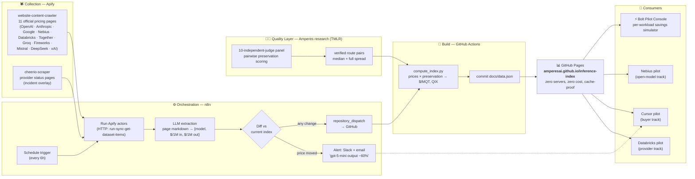
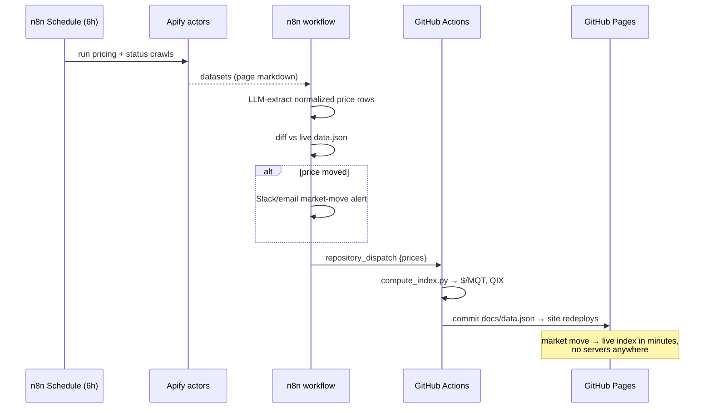

<div align="center">

# 📈 Inference Index

### The live price-per-**quality** index for LLM inference.

**Tokens are commodities. Quality isn't.**
Every pricing page tells you what a million tokens costs. None of them tell you what a million *good* tokens costs. Inference Index ranks every major inference provider by **$/MQT — dollars per million quality-adjusted tokens** — using a 10-judge evaluation panel methodology from peer-review-track research.

[**Live Index →**](https://amperesai.github.io/inference-index/) · [Methodology](#-methodology-quality-adjusted-pricing) · [Architecture](#-architecture) · [Pilot Tracks](#-pilot-tracks)

    

</div>

---

## Why this exists

The LLM inference market reprices **weekly**. Providers cut output prices 60% overnight, launch new models every few days, and deprecate the one you built on. Every team routing LLM traffic today makes a three-way bet — price, latency, quality — using a stale spreadsheet and vibes.

The missing instrument is a **quality-adjusted price**. Our research (TMLR submission, 2026) found that when you downshift a workload from Llama-3.1-70B to Llama-3.1-8B:

- 💰 **98.35% cost reduction** — real, and judge-independent.
- 🧑‍⚖️ Quality preservation is **judge-dependent**: a 10-independent-judge panel scored the *identical* response pairs anywhere from **61% to 97% preserved, median ≈ 90%**. A single lenient judge tells you 97%; a strict one tells you 74%.
- ⚠️ On real chat traffic, the cheap model is *usable* ~92–95% of the time but rated *equivalent-or-better* only ~21–32% of the time — cheap is usable-but-worse, not lossless.

So a price index that ignores quality is fiction, and a quality score from one judge is also fiction. **Inference Index publishes both dimensions honestly**: live scraped prices for the whole market, and panel-verified preservation for routed pairs as they're measured.

## What the index shows

| Column | Meaning |
|---|---|
| **Blended $/1M** | Scraped official price, blended 3:1 input:output |
| **Panel preservation** | Median of the 10-judge panel for a verified route pair (with the full 61–97% spread disclosed), or `pending` |
| **$/MQT** | Blended price ÷ panel-median preservation — the price of a million tokens *that hold up* |
| **QIX** | Quality-preserved savings vs. the tier baseline: `savings% × preservation_median` |

**Flagship verified pair** — Llama-3.1-70B → 8B: 98.35% cheaper × 90% median preservation = **QIX 88.5** — 88.5% of the spend is eliminable at panel-median quality, on benchmark workloads.

## 🏗 Architecture

Three sponsor-grade automation layers feed one static, unkillable site.



**Refresh cycle, end to end:**



## 🧪 Methodology: quality-adjusted pricing

1. **Prices are scraped, not typed.** Apify's `website-content-crawler` reads the official pricing pages (several are JS-heavy — that's why a headless crawler, not `curl`). Every number links its source URL and scrape timestamp.
2. **Quality comes from a panel, never a single judge.** Our TMLR-track research showed single-judge preservation numbers swing by 36 points on identical outputs. The index only publishes preservation as *panel median + full spread*.
3. **$/MQT** = blended $/1M ÷ panel-median preservation. A model that's 10× cheaper but preserves 60% of quality is not 10× better value — it's 6×.
4. **Honesty over hype.** Unverified rows say `pending`, never a modeled guess. The real-world caveat (usable ≠ equivalent) ships on the site, above the fold, because buyers who get burned don't come back.

## 🎯 Pilot tracks

The index is the neutral instrument; the pilots are where it earns money.

| Track | Partner conversation | What they get |
|---|---|---|
| **Provider** | **Databricks** (Foundation Model APIs) | A verified $/MQT score for hosted models — third-party proof of price-performance for their serving stack |
| **Buyer** | **Cursor** (AI coding, frontier-model spend) | Route coding traffic by $/MQT instead of raw price; panel-verified downshift pairs for code tasks |
| **Open-model** | **Nebius** (AI Studio / Token Factory) | The flagship verified pair (Llama 70B→8B, QIX 88.5) runs on exactly the open models they serve — the index is their sales sheet |

## 🤖 Agent Verify — certify the swap

**Same agent. Different model. Different behavior.** Multi-model agent platforms swap the model under an agent constantly — cost, availability, routing — and the agent's behavior silently changes: different tools called, malformed arguments, broken JSON, softer answers. Nobody measures it before shipping.

[**Agent Verify →**](https://amperesai.github.io/inference-index/agent-verify.html) runs one task suite across a baseline and N swap candidates on **any OpenAI-compatible endpoint** (OpenAI, Nebius Token Factory, Databricks serving endpoints, Together, Groq, vLLM) and scores five behavioral-equivalence dimensions:

1. **Tool fidelity** — same tools called as the baseline, no phantom calls
2. **Arg validity** — arguments parse and contain every required key
3. **Schema validity** — JSON tasks return parseable, correctly-shaped objects
4. **Non-refusal** — no refusals/empty outputs on benign tasks
5. **Equivalence** — judge-panel score vs baseline, reported as **median + spread** (never a single judge — same rule as the index)

Verdicts: `CERTIFIED` / `CAUTION` / `FAIL`. One command, zero dependencies:

```bash
python3 pipeline/agent_verify.py \
  --tasks pipeline/agent_tasks.jsonl \
  --model "baseline|https://api.openai.com/v1|gpt-5|OPENAI_API_KEY" \
  --model "swap-1|https://api.tokenfactory.nebius.com/v1|meta-llama/Meta-Llama-3.1-8B-Instruct-fast|NEBIUS_API_KEY" \
  --judge "judge-1|https://generativelanguage.googleapis.com/v1beta/openai|gemini-2.5-pro|GEMINI_API_KEY" \
  --out docs/agent-verify-report.json
```

Ten agent-shaped tasks ship in [`pipeline/agent_tasks.jsonl`](pipeline/agent_tasks.jsonl) (tool calls, multi-arg bookings, JSON extraction, and a no-tool distractor that catches over-eager tool callers). Replace them with your own agent's traces for a fleet-specific certification. The checked-in [report](docs/agent-verify-report.json) is a **clearly-labeled sample** showing the output format — generate a real one against your fleet in ~2 minutes.

**The one-two punch:** the index prices the market; Agent Verify certifies the swap. Both run on the same panel methodology.

## ⚡ Sponsor stack

| Tool | Role | Where |
|---|---|---|
| **Apify** | Scrapes 11 official pricing pages + status pages on schedule | [`pipeline/apify/`](pipeline/apify/) — ready-to-run actor inputs |
| **n8n** | The nervous system: schedule → scrape → extract → diff → alert → dispatch | [`pipeline/n8n/`](pipeline/n8n/) — importable workflow JSON |
| **Bolt** | Pilot Console: paste a workload, get a per-workload $/MQT savings simulation | [`bolt/`](bolt/) — one-paste build prompt |

## 🚀 Quickstart

```bash
git clone https://github.com/AmperesAI/inference-index
cd inference-index

# rebuild the index locally from the latest scraped prices
python3 pipeline/compute_index.py

# serve the site
python3 -m http.server -d docs 8080
```

**Run the live pipeline:** import [`pipeline/n8n/inference-index-refresh.workflow.json`](pipeline/n8n/inference-index-refresh.workflow.json) into n8n, add your Apify token, and point the final node at this repo's `repository_dispatch`. Add `APIFY_TOKEN` as a repo secret to enable the scheduled GitHub Action.

## 🗺 Roadmap

- [x] Live scraped market table (11 providers)
- [x] First panel-verified route pair (Llama-3.1-70B → 8B, 10 judges)
- [x] Agent Verify v1 — swap certification CLI + report (5 behavioral dimensions)
- [ ] Panel runs for the top-10 downshift pairs (GPT-5 → GPT-5-mini, Claude Sonnet → Haiku, DeepSeek-V3 → R1-distill)
- [ ] Per-task-type $/MQT (coding vs. extraction vs. summarization)
- [ ] Provider status overlay (Apify status-page stream)
- [ ] `GET /v1/index.json` stable API contract for routers

## 📄 Research

The quality-panel methodology comes from *Amperes: workload-aware LLM inference routing with confidence-gated escalation* (TMLR submission, 2026) — 11.4K-prompt eval across 16 public benchmarks, 10-independent-judge re-scoring panel. The index is an independent, neutral instrument built on that methodology.

## License

MIT — the index data (`docs/data.json`) is CC-BY-4.0: use it, cite it.

---

<div align="center"><sub>Built at the Apify VC Pitch Night + Hackathon, San Francisco · scraped prices belong to their providers · quality panel methodology © the authors</sub></div>
